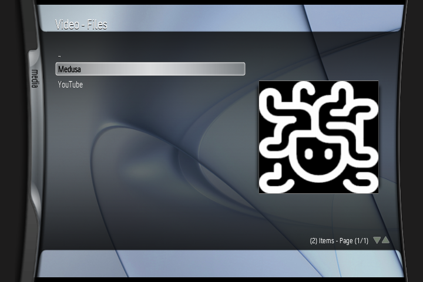
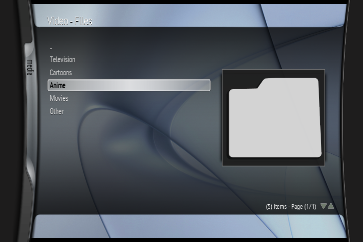
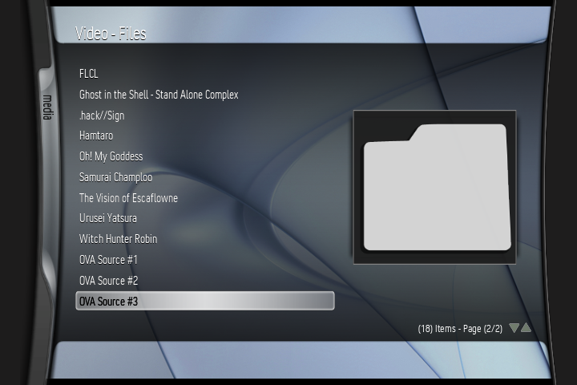
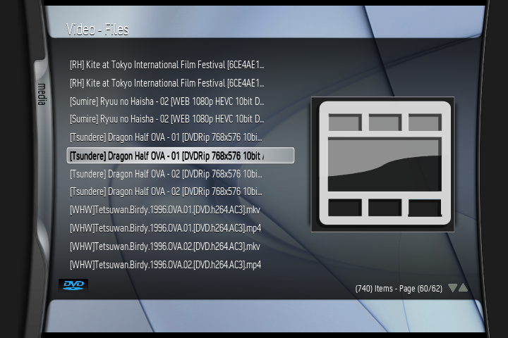
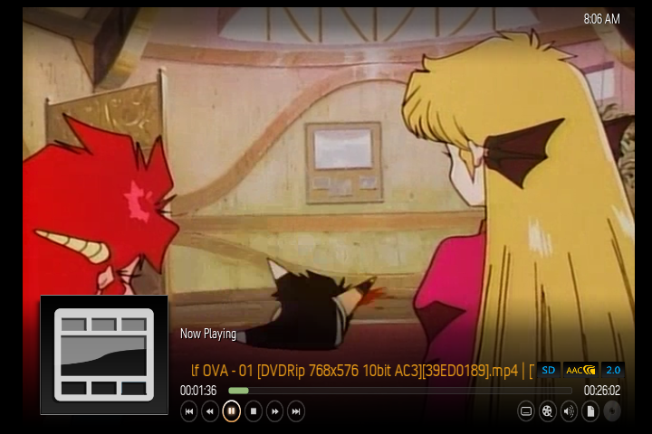

# Medusa
Internet Archive streaming add-on for XBMC. 

Requires the latest version of XBMC (3.6-DEV-r33046 or later) from Xbins (as it has crucial TLS/SSL updates that allow this script to work). Sources are NOT provided (outside of one public domain movie source) and must be input manually!

## How To Use:
- Download latest release file, or "release" folder from the repository (delete update.zip if you do!).
- Extract the .zip file, edit "default.py" and modify the "CATEGORY_COLLECTIONS =" section to point to the Internet Archive collection(s) of your choice! Just make a copy of the line below and modify it as needed, making sure the last entry in a category does not end with a comma!
- Copy the "Medusa" folder to Q:/plugins/video
- Run the add-on and enjoy!

## Issues:
- Some videos WILL crash your Xbox if they're too high-quality. This isn't the fault of the script, the Xbox is very picky about what files it's fine with (64MB and a Pentium III isn't a lot to work with). Look for specifically 360p/480p files where available.
- In a similar manner, some videos will just play as audio in the background. This also isn't the fault of the script, the Xbox just doesn't handle certain codecs well. Try a different file format or encode!
- You tell me.

## TODO:
- Implement the ability to search for and add collections on the fly.
- Improve media streaming a bit.
- Implement better filename sanitization
- Implement some sort of login system so access-locked files can be downloaded.
- Incorporate update script.
- Incorporate settings menu with the following options: Internet Archive Login - Hide Duplicate Entries - Show (X) File Type Only)
- Add companion script to add/remove sources

## Disclaimer:
- The Internet Archive is a vast archive of many files, tons of which are legal to download! Make sure you follow the copyright laws of your region while downloading from Internet Archive sources. Support will not be given for anyone trying to use this utility for blatant piracy. 
